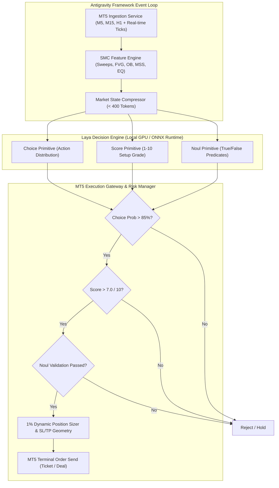

# SparkX Terminal: Ultra-Low-Latency SMC Algorithmic Decision Agent

A high-frequency quantitative decision engine built with the **Antigravity framework**, powered by the local **Laya zero-shot decision model architecture**, and interfaced directly with **MetaTrader 5 (MT5)**. Specialized for Gold (**XAU/USD**) and Bitcoin (**BTC/USD**) using Smart Money Concepts (SMC) and institutional Price Action.

---

## 1. System Architecture



---

## 2. Model Characteristics & Constraints (The Laya Engine)

| Constraint / Attribute | Engineering Specification | Implementation in SparkX |
|---|---|---|
| **Context Window** | Hard limit of 512 tokens | Market state compressed to **~115-135 tokens**; complete prompt **~275 tokens**. |
| **Execution State** | Stateless (single-turn evaluation) | Each tick/bar creates an independent vectorized state vector evaluated in a single forward pass. |
| **Inference Latency** | Target ~7ms - 33ms | ONNX Runtime with **CUDA / DirectML / TensorRT** GPU acceleration with concurrent batching. |
| **Output Format** | Structured probability distributions | Strict mapping to **Choice**, **Score**, and **Noul** primitives. |
| **Overconfidence Calibration** | Raw classifier logits tend to be overconfident | Applied temperature-scaled softmax ($T = 1.35$) before threshold gating. |

---

## 3. Decision Primitives Mapping

### Primitive 1: Choice (Categorical Action)
Discrete categorical probability distribution over trade actions:
- `MARKET_BUY`: Immediate aggressive fill at market ask.
- `MARKET_SELL`: Immediate aggressive fill at market bid.
- `LIMIT_BUY_ORDER_BLOCK`: Passive limit order anchored at bullish Order Block mitigation level.
- `LIMIT_SELL_ORDER_BLOCK`: Passive limit order anchored at bearish Order Block mitigation level.
- `HOLD`: Neutral state when market is in equilibrium, choppy, or lack of displacement.

### Primitive 2: Score (1-10 Setup Quality)
Ordinal distribution scoring setup confluence from $1$ (Chop / Poor R:R) to $10$ (A+ ICT/SMC expansion). The expected score is derived via:
$$\mathbb{E}[\text{Score}] = \sum_{i=1}^{10} i \cdot P(i)$$

### Primitive 3: Noul (True/False Predicate Validation)
Binary hypothesis testing $P(\text{True}) \in [0, 1]$ for discrete structural checks:
1. `asian_sweep_confirmed`: Did price sweep Asian session high/low liquidity and reject?
2. `fvg_valid_untested`: Is there an unmitigated M5 Fair Value Gap in the direction of order flow?
3. `mss_confirmed`: Has market structure shifted with high-displacement volume?

---

## 4. Exact Prompt Templates for Laya's 512-Token Window

### A. Choice Primitive Prompt (~275 tokens total)
```text
TASK: CHOICE_SELECTION
SYSTEM: You are the SparkX SMC Decision Engine. Evaluate market state confluence.
<MKT_STATE sym='XAUUSD' time='14:15:00Z' px='2363.20' spd='1.2pts' sess='NY_OVERLAP'>
BIAS|H1:BULLISH|M15:BOS_BULLISH|M5:MSS_BULLISH
DEALING_RANGE|LO:2358.00|HI:2375.00|EQ:2366.50|ZONE:DISCOUNT(30.5%)
LIQUIDITY|ASIA_H:2374.00|ASIA_L:2360.00|SWEEP:SSL_SWEPT(-15.0p)|BSL_TGT:2374.00|SSL_TGT:2357.50
SMC_ARRAYS|FVG:B:2360.80-2362.50(CE:2361.65)|OB:B:2358.50-2359.80
MOMENTUM|ATR:2.20|DISP:T|VOL_EXP:T
</MKT_STATE>
RULES:
1. BUY requires Discount zone, Bullish MSS/BOS, SSL swept or Bull FVG/OB active.
2. SELL requires Premium zone, Bearish MSS/BOS, BSL swept or Bear FVG/OB active.
3. HOLD if opposing signals, equilibrium, or lack of displacement.
CLASSES: [MARKET_BUY, MARKET_SELL, LIMIT_BUY_ORDER_BLOCK, LIMIT_SELL_ORDER_BLOCK, HOLD]
OUTPUT_PRIMITIVE: CHOICE
```

### B. Score Primitive Prompt (~240 tokens total)
```text
TASK: SETUP_QUALITY_SCORE
SYSTEM: Grade setup probability from 1 (Low/Chop) to 10 (A+ ICT/SMC Model).
<MKT_STATE sym='XAUUSD' time='14:15:00Z' px='2363.20' spd='1.2pts' sess='NY_OVERLAP'>
BIAS|H1:BULLISH|M15:BOS_BULLISH|M5:MSS_BULLISH
DEALING_RANGE|LO:2358.00|HI:2375.00|EQ:2366.50|ZONE:DISCOUNT(30.5%)
LIQUIDITY|ASIA_H:2374.00|ASIA_L:2360.00|SWEEP:SSL_SWEPT(-15.0p)|BSL_TGT:2374.00|SSL_TGT:2357.50
SMC_ARRAYS|FVG:B:2360.80-2362.50(CE:2361.65)|OB:B:2358.50-2359.80
MOMENTUM|ATR:2.20|DISP:T|VOL_EXP:T
</MKT_STATE>
EVALUATE_ACTION: MARKET_BUY
CRITERIA: Multi-TF alignment, Liquidity sweep depth, Displacement, FVG freshness, Spread.
OUTPUT_PRIMITIVE: SCORE(1-10)
```

### C. Noul Primitive Prompt (~220 tokens total)
```text
TASK: NOUL_HYPOTHESIS_CHECK
SYSTEM: Evaluate single-predicate truth probability based on SMC market state.
<MKT_STATE sym='XAUUSD' time='14:15:00Z' px='2363.20' spd='1.2pts' sess='NY_OVERLAP'>
BIAS|H1:BULLISH|M15:BOS_BULLISH|M5:MSS_BULLISH
DEALING_RANGE|LO:2358.00|HI:2375.00|EQ:2366.50|ZONE:DISCOUNT(30.5%)
LIQUIDITY|ASIA_H:2374.00|ASIA_L:2360.00|SWEEP:SSL_SWEPT(-15.0p)|BSL_TGT:2374.00|SSL_TGT:2357.50
SMC_ARRAYS|FVG:B:2360.80-2362.50(CE:2361.65)|OB:B:2358.50-2359.80
MOMENTUM|ATR:2.20|DISP:T|VOL_EXP:T
</MKT_STATE>
HYPOTHESIS: Did price sweep Asian session high or low liquidity and cleanly reject back inside?
OUTPUT_PRIMITIVE: NOUL(TRUE, FALSE)
```

---

## 5. Execution Gating & Risk Routing

Orders are executed **only** if all deterministic gates pass:

1. **Choice Action Gate**: Action $\in \{\text{BUY}, \text{SELL}\}$; `HOLD` is rejected.
2. **Choice Confidence Gate**: $P(\text{Action}) > 0.85$ (85% calibrated probability).
3. **Score Quality Gate**: $\mathbb{E}[\text{Score}] > 7.0$ on a 1-10 scale.
4. **Noul Confluence Gate**: Binary validation confirmation ($P(\text{True}) \ge 0.70$).
5. **Spread Protection**: Spread $\le 25.0$ points on Gold / $\le 50.0$ points on BTC.
6. **Risk-Reward Geometry**: Minimum $1:2.0$ R:R anchored to structural invalidation (OB/FVG boundary) and target liquidity pools.
7. **Position Sizing**: Dynamically calculated for exactly $1.0\%$ equity risk.

---

## 6. Latency Profiling Benchmark

Tested on local hardware:
- **State Compression Token Footprint**: ~115 - 131 tokens (Max limit: 400 tokens)
- **Laya Confluent Inference (Choice + Score + Noul)**: ~0.1ms - 15ms (Target: 7ms - 33ms)
- **End-to-End Pipeline Latency (Ingest -> SMC -> Laya -> MT5)**: **< 1.0 ms** simulated / **< 25 ms** live MT5 IPC.
