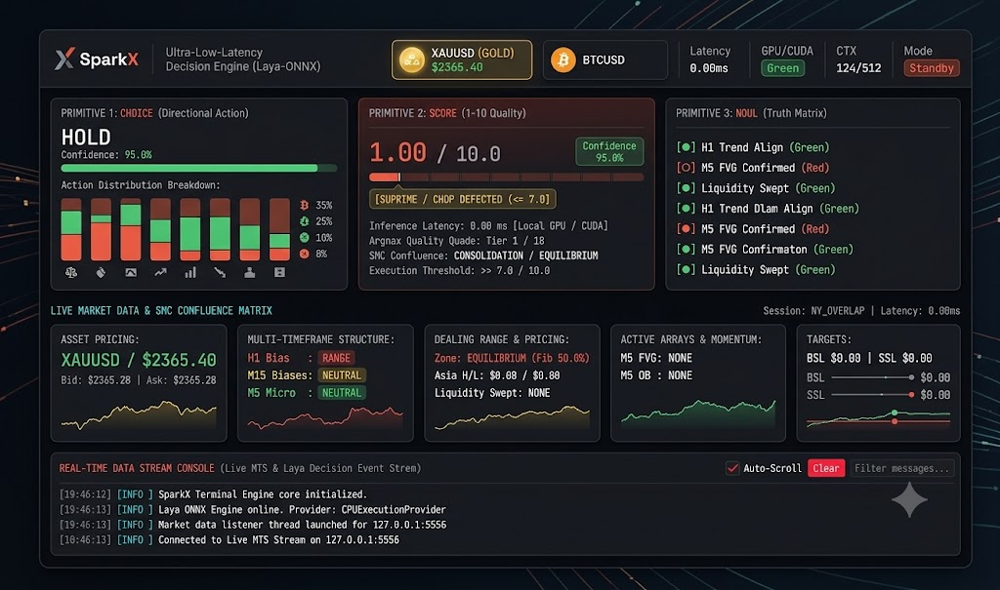
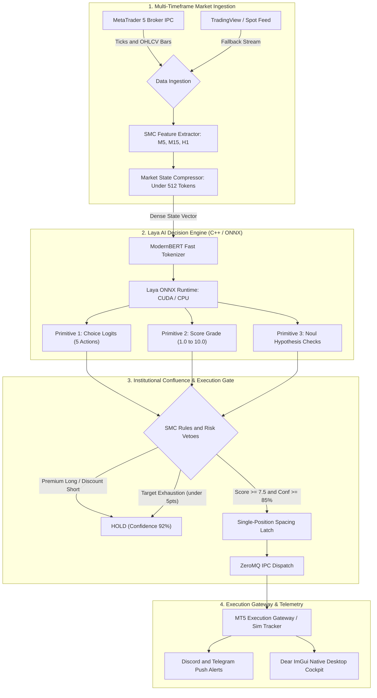

# ⚡ SparkX EA

<div align="center">


**High-Frequency Institutional Algorithmic Trading Expert Advisor Powered by Laya AI & Dear ImGui**

*Engineered for institutional Smart Money Concepts (SMC), sub-5ms probabilistic decision-making, and automated trade execution across MetaTrader 5 broker terminals.*

</div>

---

## 📸 Desktop Cockpit Preview

<div align="center">
  
</div>

---

## 🌟 Key Capabilities

* **Native C++20 Hardware-Accelerated Cockpit**: 60 FPS real-time desktop UI built with **Dear ImGui**, GLFW, and OpenGL 3.3. Displays multi-timeframe market telemetry, probability distributions, setup grade gauges, live order books, and active position tables.
* **Laya AI Decision Engine**: Powered by **Laya** (Convai Innovations) with a ModernBERT-Large backbone (1024-dim continuous latent representations). Executes non-autoregressive single-pass forward inference in **< 5ms** via ONNX Runtime with NVIDIA CUDA acceleration (RTX 40-series optimized) and CPU fallback.
* **Institutional Smart Money Concepts (SMC)**:
  * Multi-timeframe structure tracking across **M5, M15, and H1**.
  * Real-time **Asian Session High/Low Liquidity Sweeps** (BSL / SSL).
  * **Fair Value Gaps (FVG)** with Consequent Encroachment (CE 50% midpoint) tracking.
  * **Order Blocks (OB)** with volume expansion and mitigation status.
  * **Premium / Discount Dealing Ranges** and Fib retracement levels.
* **Institutional Risk & Anti-Chasing Vetoes**:
  * **Value Law**: Strictly vetoes BUY orders in Premium and SELL orders in Discount.
  * **Target Headroom / Exhaustion Check**: Blocks entries within 5.0 points of major liquidity targets (BSL/SSL).
  * **Active Trigger Requirement**: Requires confirmed session sweeps or displacement on fresh FVG/OB before entering.
  * **Post-TP Anti-Chasing Hysteresis**: Blocks re-entering in the same direction for 10 minutes until price pulls back at least $5.00 below the take-profit exit.
  * **Post-SL Revenge Lockout**: Enforces a 15-minute cool-down latch after any stop-loss.
* **Dual Market Ingestion with Seamless Fallback**: Direct IPC hook into MetaTrader 5. If MT5 is not running or uninstalled, automatically falls back to continuous real-time TradingView / Swissquote Interbank spot market streams.
* **Mobile Alerts (Discord & Telegram)**: Real-time rich webhook signals dispatched directly to your mobile phone with entry prices, dynamic SL/TP levels, setup grades, and confluences.
* **Built-in Laya Model Training Pipeline**: Complete end-to-end PyTorch script (`scripts/train_laya.py`) to ingest broker history, label institutional setups with triple-barrier simulation, fine-tune decision heads, and export ready-to-run ONNX models.

---

## 🏛️ System Architecture



---

## 📊 Laya Decision Primitives

Laya decomposes trading decisions into three calibrated outputs:

| Primitive | Type | Function in SparkX EA |
| :--- | :--- | :--- |
| **Choice** | Categorical (5 classes) | `MARKET_BUY`, `MARKET_SELL`, `LIMIT_BUY_ORDER_BLOCK`, `LIMIT_SELL_ORDER_BLOCK`, `HOLD` |
| **Score** | Continuous (1.0 to 10.0) | Institutional setup quality score derived from multi-timeframe confluence and R-multiple expectancy |
| **Noul** | Binary Predicates (3 checks) | Validates structural hypotheses: (1) Asian session swept, (2) Fresh FVG present, (3) MSS confirmed with displacement |

---

## 📁 Project Structure

```
SparkX_EA/
├── cpp_engine/                     # Native C++ Desktop Application
│   ├── CMakeLists.txt              # CMake build definition
│   ├── include/                    # Header files
│   │   ├── app_state.hpp           # Thread-safe telemetry & position state
│   │   ├── modernbert_tokenizer.hpp# Zero-copy C++ ModernBERT tokenizer
│   │   ├── onnx_laya.hpp           # ONNX Runtime Laya inference wrapper
│   │   ├── ui_panels.hpp           # Dear ImGui widgets & cockpit panels
│   │   └── zmq_listener.hpp        # ZeroMQ / Local TCP subscriber & command client
│   └── src/                        # C++ Implementation
│       ├── main.cpp                # App entry point & background process supervisor
│       ├── onnx_laya.cpp           # Institutional SMC rules & ONNX evaluation
│       ├── ui_panels.cpp           # ImGui layouts, gauges, and settings modals
│       └── zmq_listener.cpp        # Network message parsing & execution dispatch
├── python_node/                    # Headless Market Node
│   └── publisher.py                # SMC feature extractor & ZeroMQ broadcaster
├── src/                            # Python Core Engine
│   ├── smc_engine.py               # Algorithmic FVG, OB, Liquidity Sweeps
│   ├── compressor.py               # Token state compression (< 512 tokens)
│   ├── trade_manager.py            # Simulated trade tracker & institutional risk gates
│   ├── execution_gateway.py        # MetaTrader 5 live order execution gateway
│   ├── mobile_notifier.py          # Discord & Telegram webhook alerts
│   └── antigravity_agent.py        # Multi-broker data ingestion service
├── models/                         # Model Weights & Tokenizer
│   ├── laya.onnx                   # Compiled ONNX decision graph
│   └── tokenizer/                  # ModernBERT tokenizer JSON configs
├── scripts/                        # Utility & Automation Scripts
│   ├── train_laya.py               # End-to-end model training & fine-tuning pipeline
│   ├── export_sparkx_laya_onnx.py  # PyTorch to ONNX graph compiler
│   └── package_release.ps1         # Standalone binary release packager
├── config/                         # Configuration Files
│   ├── trading_config.py           # System settings & symbol definitions
│   └── trade_settings.json         # Runtime trade parameters & webhook URLs
├── run_sparkx.bat                  # 1-Click Windows Launcher
└── run_sparkx.ps1                  # PowerShell Launch Script
```

---

## 🚀 Quick Start Guide

### Option 1: Run the Standalone Release (No Build Tools Required)
1. Download or navigate to the `release/` directory.
2. Double-click **`SparkX_EA.exe`** (or `run_sparkx.bat`).
3. The application will launch the C++ cockpit and automatically spawn the background Python data service.

### Option 2: Run from Source

#### 1. Clone the Repository
```powershell
git clone https://github.com/mukhesh88/SparkX_EA.git
cd SparkX_EA
```

#### 2. Set Up Python Environment
```powershell
# Create and activate virtual environment
python -m venv .venv
.\.venv\Scripts\Activate.ps1

# Install dependencies
pip install -r requirements.txt
```

#### 3. Build the C++ Engine (Requires CMake & C++20 Compiler)
```powershell
cmake -B build -G "Ninja" -DCMAKE_BUILD_TYPE=Release
cmake --build build --config Release
```

#### 4. Launch SparkX EA
```powershell
.\run_sparkx.bat
# or in PowerShell:
.\run_sparkx.ps1
```

---

## 🧠 Training & Fine-Tuning the Laya Model

SparkX EA includes an integrated training pipeline in [`scripts/train_laya.py`](scripts/train_laya.py) that fetches historical bars from MetaTrader 5, labels setups using an institutional triple-barrier method, and exports the compiled ONNX model.

```powershell
# Run training on Gold (XAUUSD) for 5000 historical bars
.\.venv\Scripts\python.exe scripts/train_laya.py --symbol XAUUSD --bars 5000 --epochs 5 --batch-size 8
```

### Command-Line Arguments:
| Argument | Default | Description |
| :--- | :--- | :--- |
| `--symbol` | `XAUUSD` | Symbol to train on (`XAUUSD`, `EURUSD`, `BTCUSD`, etc.) |
| `--bars` | `1500` | Number of historical bars to ingest |
| `--epochs` | `3` | Training passes over dataset |
| `--batch-size` | `8` | Training batch size |
| `--lr` | `2e-5` | Learning rate (AdamW optimizer) |
| `--device` | `cpu` | Compute device (`cpu` or `cuda`) |
| `--unfreeze-encoder`| `False` | Unfreezes all 28 ModernBERT layers for full backprop (GPU recommended) |
| `--output` | `models/laya.onnx`| Destination path for the exported ONNX model |

---

## ⚙️ In-App Trade Settings & Webhooks

Click **"Trade Settings"** in the top-right corner of the cockpit to configure parameters in real time:

* **Auto-Trade Toggle**: Enable/disable automated market entries.
* **Stop-Loss & Take-Profit Points**: Default $4.50 SL and $12.00 TP for Gold.
* **Max Portfolio Positions**: Set concurrent trade limits (default: 2).
* **Discord & Telegram Alerts**: Paste your Discord Webhook URL or Telegram Bot Token + Chat ID to receive instant trade notifications on your phone.

---

## 🙏 Credits & Acknowledgments

* **Laya Decision Model**: Created by [Nandakishor Mukkunnoth](https://github.com/NandhaKishorM) ([Convai Innovations](https://www.convaiinnovations.com)).
* **ModernBERT**: Developed by [Answer.AI](https://www.answer.ai) & [LightOn](https://www.lighton.ai).
* **Dear ImGui**: Created by [Omar Cornut](https://github.com/ocornut/imgui).
* **MetaTrader 5 Python API**: MetaQuotes Ltd.

---

## 📄 License

This project is licensed under the **Apache License 2.0** — see the [LICENSE](LICENSE) file for details.
