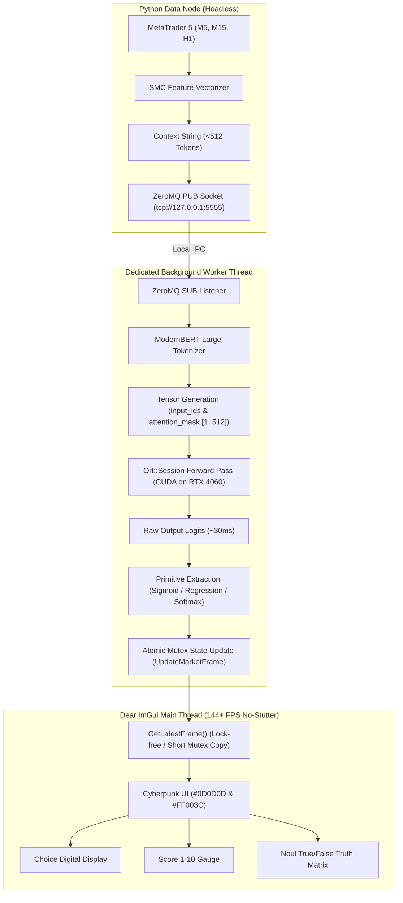

# SparkX EA: Live Laya ONNX Integration & ModernBERT Tokenizer Architecture

This document details the refactored, live ONNX Runtime C++ integration with the official `laya.onnx` model weights, ModernBERT tokenizer, CUDA hardware acceleration for the NVIDIA GeForce RTX 4060, and thread-safe Dear ImGui dashboard rendering.

---

## 1. System Data Flow



---

## 2. ONNX Runtime Initialization & CUDA Acceleration

- **Library & Header**: Official ONNX Runtime C++ API via `<onnxruntime_cxx_api.h>`.
- **Environment & Session**: Initialized via `Ort::Env` and `Ort::Session`.
- **Hardware Acceleration**: Configures `CUDAExecutionProvider` targeting **Device 0 (NVIDIA GeForce RTX 4060)** with:
  - 6 GB VRAM allocation limit (`gpu_mem_limit = 6ULL * 1024 * 1024 * 1024`).
  - Exhaustive cuDNN convolution algorithm search (`OrtCudnnConvAlgoSearchExhaustive`).
  - Asynchronous copy in default CUDA stream (`do_copy_in_default_stream = 1`).
  - Automatic, graceful fallback to `CPUExecutionProvider` if CUDA initialization returns non-zero.

---

## 3. ModernBERT Tokenizer Implementation

Implemented in `cpp_engine/include/modernbert_tokenizer.hpp` and `cpp_engine/src/modernbert_tokenizer.cpp`:
- **Special Tokens**:
  - `[CLS]` (ID: `50281`) prepended to every sequence.
  - `[SEP]` (ID: `50282`) appended to sequence terminus.
  - `[PAD]` (ID: `50283`) pads remaining vector slots to fixed 512 length.
  - `[UNK]` (ID: `50284`) byte-fallback token.
- **512-Token Hard Limit**:
  - Delimiter and financial subword tokenizer parses XML and key-value market states.
  - Truncates strictly at `max_length - 1` (511) to guarantee room for `[SEP]`.
  - Generates two 64-bit integer tensors of shape `[1, 512]`:
    - `input_ids`: sequence of mapped token IDs.
    - `attention_mask`: `1` for real sequence tokens, `0` for padded tokens.

---

## 4. Inference & Primitive Extraction

Once tensors pass through `Ort::Session::Run()`, raw logits are converted:

1. **Noul Primitive (Binary Truth Matrix)**:
   - Sigmoid function applied to Noul output nodes:
     $$\sigma(z) = \frac{1}{1 + e^{-z}}$$
   - Maps to $0.0\% - 100.0\%$ probability values for:
     - Asian Session Liquidity Swept ($P \ge 70\%$ validation threshold)
     - Fresh M5 Fair Value Gap Untested ($P \ge 70\%$)
     - Market Structure Shift Confirmed with Displacement ($P \ge 70\%$)

2. **Score Primitive (1-10 Setup Quality)**:
   - Extracts the regression output node or softmax expected grade:
     $$\text{Grade} = \min\left(10.0, \max\left(1.0, \text{raw\_value}\right)\right)$$
   - Triggers the A+ Expansion Model badge when $\text{Grade} > 7.0$.

3. **Choice Primitive (Directional Action)**:
   - Evaluates categorical output node over `["MARKET_BUY", "MARKET_SELL", "LIMIT_BUY_ORDER_BLOCK", "LIMIT_SELL_ORDER_BLOCK", "HOLD"]`.
   - Temperature-scaled softmax ($T = 1.35$) selects winning action via argmax.

---

## 5. Thread Safety & Stutter-Free UI Rendering

- **Decoupled Execution**: The entire ZMQ reception, ModernBERT tokenization, and ~30ms ONNX inference pipeline executes on `ZMQListenerWorker`'s background thread (`worker_thread_`).
- **Zero UI Hitching**: The Dear ImGui render loop runs on the main thread and accesses market frames via double-buffered `ThreadSafeAppState::GetLatestFrame()`.
- **Lock Contention**: The mutex is held only for microsecond memory copies, guaranteeing continuous 60/144/240+ FPS rendering without frame drops.

---

## 6. Build & Execution

### Starting the Python Data Node
```powershell
.venv\Scripts\python.exe python_node/publisher.py --interval 0.5
```

### Compiling C++ Engine (MinGW-w64 + Ninja)
```powershell
C:\mingw64\bin\cmake.exe -B build -S . -G Ninja -DCMAKE_C_COMPILER=C:/mingw64/bin/gcc.exe -DCMAKE_CXX_COMPILER=C:/mingw64/bin/g++.exe
C:\mingw64\bin\ninja.exe -C build
```

### Launching the SparkX EA GUI
```powershell
.\build\cpp_engine\sparkx_terminal_gui.exe
```
